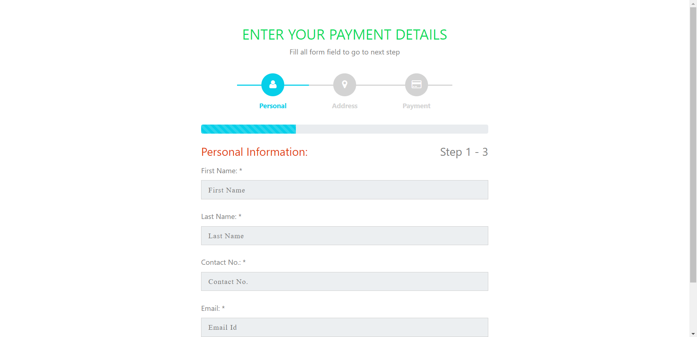

# Step Form

In this page there are a list of products shown. Here we can filter the products using the fields in filter section.


## Installation

Step 1: Download the .zip file of the source code. Extract it and then move it to htdocs folder.

Step 2: Start your XAMPP Server and hit the below given URL:
```bash
  http://localhost/step-form
```

After visiting ths url the project will start.
    
## Features

- The form validation will start when you will start filling any field.

## Tech Stack

**Client:** HTML, CSS, JS, Bootstrap

**Server:** CodeIgnitor4(PHP)


## Screenshots




## License

[MIT](https://choosealicense.com/licenses/mit/)

